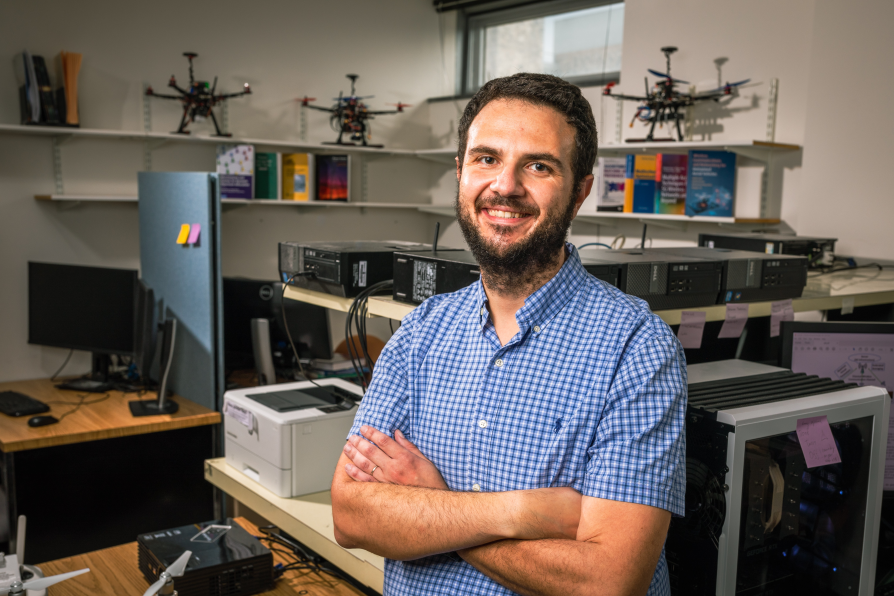

<!-- <h1 style="text-align: center;">First Workshop on 6G Enablers: Satellite, Qualitative and Semantic Communications</h1> -->

  

    
  

  

    <h1 style="text-align: center; padding-right:40px; line-height:1em;">First Workshop on 6G Enablers: Satellite, Qualitative and Semantic Communications</h1>
  

<h4 style="text-align: center;line-height:2em;">Organized by: IEEE ICNP 2023</h4>
<h5 style="text-align: center; line-height:0em;">The 31st IEEE International Conference on Network Protocols</h5>
<h6 style="text-align: center;line-height:0em;">Reykjavik, Iceland, October 10-13, 2023</h6>

<h2 style="text-align: center;">Keynote Speakers Announced</h2>

### Keynote 1: Professor Walid Saad, Virginia Tech

 
*Bio* Prof. Saad (S’07, M’10, SM’15, F’19) received his Ph.D. degree from the University of Oslo, Norway, in 2010. He is currently a Professor at the Department of Electrical and Computer Engineering at Virginia Tech, where he leads the Network sciEnce, Wireless, and Security (NEWS) laboratory. He is also the Next-G Wireless Faculty Lead at Virginia Tech’s Innovation Campus. His research interests include wireless networks (5G/6G/beyond), machine learning, game theory, security, UAVs, semantic communications, cyber-physical systems, and network science. Dr. Saad is a Fellow of the IEEE. He is also the recipient of the NSF CAREER award in 2013, the AFOSR summer faculty fellowship in 2014, and the Young Investigator Award from the Office of Naval Research (ONR) in 2015. He was the (co-)author of eleven conferences' best paper awards at IEEE WiOpt in 2009, ICIMP in 2010, IEEE WCNC in 2012, IEEE PIMRC in 2015, IEEE SmartGridComm in 2015, EuCNC in 2017, IEEE GLOBECOM (2018 and 2020), IFIP NTMS in 2019, IEEE ICC (2020 and 2022). He is the recipient of the 2015 and 2022 Fred W. Ellersick Prize from the IEEE Communications Society  and of the IEEE Communications Society Marconi Prize Award in 2023. He was also a co-author of the papers that received the IEEE Communications Society Young Author Best Paper award in 2019, 2021, and 2023. Other recognitions include the 2017 IEEE ComSoc Best Young Professional in Academia award, the 2018 IEEE ComSoc Radio Communications Committee Early Achievement Award, and the 2019 IEEE ComSoc Communication Theory Technical Committee Early Achievement Award. From 2015-2017, Dr. Saad was named the Stephen O. Lane Junior Faculty Fellow at Virginia Tech and in 2017, he was named College of Engineering Faculty Fellow. He received the Dean’s Award for Research Excellence from Virginia Tech in 2019. He was also an IEEE Distinguished Lecturer in 2019-2020.  He has been annually listed in the Clarivate Web of Science Highly Cited Researcher List since 2019. He currently serves as an Area Editor for the IEEE Transactions on Network Science and Engineering and the IEEE Transactions on Communications. He is the Editor-in-Chief for the IEEE Transactions on Machine Learning in  Communications and Networking.

 Less Data, More Knowledge: Reasoning Foundations of Semantic Communication Networks 

*Abstract:* For decades, the wireless link between transmitter and receiver has been seen as a mere  bit pipe whose goal is to faithfully reconstruct the exact transmitted signal at the receiver without paying attention to the meaning or effect of the source message. This classical design may excel in delivering high communication rates and low bit-level errors, but its limitations become apparent when faced with the challenge of transmitting massive data streams for connected intelligence, Internet of Senses, or holographic applications, where the message intent and effectiveness must be considered, and extremely stringent requirements for reliability and latency must be met, often simultaneously. In this regard, the concept of semantic communication, in which the meaning of the source messages is incorporated in the design of a communication link, has recently emerged as a promising solution. However, despite a recent surge of efforts in this area, remarkably, the research landscape is still limited to basic constructs in which even the very definition of “semantics” remains ambiguous. In this talk, we seek to remove this ambiguity and present a bold, forward-looking vision of how to build and design semantic communication networks from the ground up. In particular, we opine that major breakthroughs in semantic communications can only be made by equipping the communication nodes with the capability to exploit information semantics at a fundamental level (from the data structure and relationships) which enables them to build a knowledge base, reason on their data, and engage in the form of communication using a machine language, similar to human conversation, with the capability to deduce meaning from the data in a manner akin to human reasoning. Towards this goal, we introduce our holistic vision for semantic communications that is firmly grounded in rigorous artificial intelligence (AI) and causal reasoning foundations, with the potential to revolutionize the way information is modeled, transmitted, and processed in communication systems. We show how, by embracing semantic communication through our proposed vision, we can usher in a new era of knowledge-driven, reasoning wireless networks that are more sustainable and resilient than today’s data-driven, knowledge-agnostic networks. We also shed light on how this framework can create AI-native networks – a key requirement of future wireless systems. As a key step towards enabling this paradigm shift, we present our recent key results in this area, with foundations in AI, theory of mind, and game theory, that showcase how the proposed approach for semantic communications can reduce the volume of data circulating in a network while improving reliability, two critical requirements for emerging wireless services, such as connected intelligence and digital twins. We conclude with a discussion of future opportunities in this exciting area.

### Keynote 2: Professor Shangguang Wang, Beijing University of Posts and Telecommunications

|{:width="950px"}*Shangguang Wang* | *Bio* Shangguang Wang is a professor at the School of Computer Science, Beijing University of Posts and Telecommunications, China. He is the founder&chief scientist of Tiansuan Constellation. He is also Deputy Dean at the School of Computer Science, Deputy Dean at Shenzhen Research Institute, Deputy Director at SKL of Networking and Switching Technology, and Director at Star Network and Intelligence Computing Laboratory. His research interests include service computing, mobile edge computing, cloud computing, and satellite computing. He is currently serving as chair of the IEEE Technical Community on Services Computing(TCSVC) and vice chair of the IEEE Technical Community on Cloud Computing. He also served as general chair or program chair of 10+ IEEE conferences and advisor/associate editor of several journals such as the Journal of Cloud Computing, Journal of Software: Practice and Experience, International Journal of Web and Grid Services, China Communications, and so on. He is a senior member of the IEEE and a Fellow of the IET.|

 Title: TBA 

*Abstract: TBD*

---

<h2 style="text-align: center;">CALL FOR PAPERS</h2>

Non-Terrestrial Network (NTN) integration is an ambitious mission in 3GPP to extend the Internet to sky and outer space. Currently, 
NTN has been widely accepted as a major roadblock for 6G. One of the goals of 6G is to enable large-scale Low Earth Orbit (LEO) 
satellite constellations to form different moving networks that can be integrated with the Internet. In the future, LEO satellite 
networks will become part of the Internet and be used for 5G/6G wireless access and back-haul network for wireless service providers, 
and transport network for terrestrial service providers. 
Moreover, the use of LEO satellite constellations also has its own technical challenges as these constellations move at high velocity 
(>7 km/s) and use over 10k satellites plus millions of ground stations. Various challenges need to be addressed, spanning multiple 
areas such as direct cellphone-to-satellite connectivity, wireless access architecture utilizing gNB on LEO satellites, power management 
and antenna technology for both end-user devices and satellites, IP-capable satellites, and large-scale satellite networks, free 
space optical communication for inter-satellite-link (ISL), tracking technology for ISL, and ground stations, among others.

On the other hand, 6G communication intends to shift the conventional symbol-based communication systems 
that are nearing the Shannon capacity limit to Qualitative and Semantic Communications. These communications 
share the same principle: the intended message to be transmitted by the sender does not need to be matched bit-by-bit 
to the received message. Qualitative Communication enables the receiver to consume some portion of the packet or a 
modified version of the packet in a timely manner. Similarly, Semantic Communication focuses on the significance of 
transmitted symbols or bits. In this paradigm, a transmission that involves distorted symbols does not necessarily 
indicate semantic errors, and the receiver can still acquire the intended message. 

These new paradigms aim to improve the efficiency and effectiveness of communication systems to support the 
demanding applications of 6G. To fully realize the potential of these emerging communication paradigms, further 
research and development are required. Achieving this objective includes a meticulous redesign of network architecture, 
network protocols, information encoding, processing, decoding, packet transmission, routing, and other related components.

This workshop aims to bring together researchers, practitioners, and industry experts to present and discuss 
recent advancements and future directions for 6G enablers: Satellite, Qualitative, and Semantic Communications. 

## Topics of Interest

Topics of interest for this workshop include, but are not limited to:

- Satellite Connectivity: addressing scheme, DNS deployment, path determination, packet forwarding and switching, IGP and BGP Routing protocols, etc.
Satellite Mobility: mobility processing, seamless handover, multi-path support, etc.
- Traffic Engineering and QoS in NTN: traffic steering, QoS support, congestion avoidance, load balancing, etc.
- NTN Integration: 5G SBA architecture enhancement, gNB on satellite, security enhancement, edge computing on satellite, satellite network sharing, etc.
Application of AI to a wide variety of satellite communication aspects
- Redesigning network architecture to enable Qualitative and Semantic Communication
- Information Processing for Qualitative and Semantic Communication
- Use cases of Qualitative and Semantic Communication 
- Standards and Protocols for Qualitative and Semantic Communication
- End-to-end system design for Qualitative and Semantic Communication
- Methods and theories of semantic information measurement
- Semantic entropy theory
- Deep Learning (DL), Reinforcement Learning (RL), Knowledge Base (KB), etc. for semantic information extraction
- Information and packet encoding/decoding
- Caching and routing in Qualitative and Semantic Communication
- Experiments and testbeds for Qualitative and Semantic Communication
- Privacy and Security in Qualitative and Semantic Communication
- Network protocol design for Qualitative and Semantic Communication 
- In-time guarantee by Qualitative and Semantic Communication
- Energy consumption reduction by Qualitative and Semantic Communication
- Integration of Qualitative and Semantic Communication with conventional communication systems

----

## Submission Instructions

Submissions must be original, unpublished work, and not under consideration at another conference or journal. Paper submissions should adhere to the IEEE Conference formatting requirements with double columns and the font size must be 10 points. Submitted papers must be written in English and have no more than Six (6) pages in double-column format with standard margins, two (2) additional pages may be permitted with over-length fee of $100/page. Papers must include author’s names and affiliations for single-blind peer reviewing by the PC. Authors of accepted papers are expected to present their papers at the workshop onsite. If there are situations that prevent the authors from attending the workshop, the authors must discuss with the chairs case-by-case, and Zoom meetings might be provided for online presenters.

The IEEE template [available here](https://www.ieee.org/conferences/publishing/templates.html)

#### Paper Submission

Official ICNP 2023 Submission page: https://sqsc23.hotcrp.com

## Programme Committee

#### General Co-Chairs

- Lijun Dong, Futurewei Technologies Inc., U.S.A
- Roberto Rojas-Cessa, New Jersey Institute of Technology, U.S.A

#### Workshop PC Co-Chairs

- Muge Sayit, Ege University, Turkey
- Lin Han, Futurewei Technologies Inc., U.S.A

### Technical Programme Committee

- Yuanjie Li, Tsinghua University, China
- Alessio Sacco, Polytechnic University of Turin, Italy
- Yuanwei Liu, Queen Mary University of London, U.K.
- Tooba Faisal, Nokia Bell-Labs, France
- Kaibin Huang, Hong Kong University, China
- Sheng Jiang, Beijing University of Posts and Telecommunications, China
- Alex Clemm, Futurewei Technologies Inc., U.S.A
- Shangguang Wang, Tiansuan Constellation, China
- Chin-Tser Huang, University of South Carolina, U.S.A
- Tarik Taleb, University of Oulu, Finland
- Yuanzhu Chen, Queen’s University, Canada
- Mehdi Bennis, University of Oulu, Finland
- Tianji Jiang, China Mobile, U.S.A
- Hongxiang Li, University of Louisville, U.S.A
- Stuart Clayman, University College London, U.K.
- Yong Xiao, Huazhong University of Science and Technology, China
- Nirmala Shenoy, Rochester Institute of Technology, U.S.A
- Jiang Liu, Beijing University of Posts and Telecommunications, China

---

## Important dates: (tentative)

| Title / Abstract registration	| ~~~July 1, 2023 (8:00 p.m. EDT)~~~ July 24, 2023 (8:00 p.m. EDT)|
| Full paper submission	| ~~~July 7, 2023 (8:00 p.m. EDT)~~~ July 31, 2023, (8:00 p.m. EDT) |
| Notification of acceptance |	August 20, 2023 |
| Camera ready version | 	August 31, 2023 |
