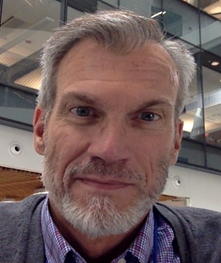
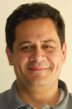

<!-- <h1 style="text-align: center;">1st Workshop on New IP and Beyond</h1> -->

  

    
  

  

    <h1 style="text-align: center; padding-right:40px; line-height:1em;">1st Workshop on New IP and Beyond</h1>
  

<h4 style="text-align: center;line-height:2em;">30th October 2022, Organized by: IEEE ICNP 2022</h4>
<h5 style="text-align: center; line-height:0em;">The 30th IEEE International Conference on Network Protocols</h5>
<h6 style="text-align: center;line-height:0em;">Lexington, Kentucky, USA, October 30-November 2, 2022</h6>

<h2 style="text-align: center;">New IP and Beyond - Full Day Workshop Program</h2>

##### About the Workshop

The __New IP and Beyond__ workshop aims to discuss research challenges in fixed-network protocols complementing 5G, B5G and 6G technologies. The focus is on the realization of large-scale, special-purpose industry verticals, autonomous operations, reliable supply-chains, metaverse and digital twins. Such networks require, an extremely reliant, intelligent, and lean networks.

---

## Agenda

### Session 1 (Keynote)
#### 09:30 AM - 10:15 AM &emsp;&emsp;*Welcome and Keynote*

 Session Chair: Kiran Makhijani

|9:30 |[Opening & Welcome Note by Chairs (10 minutes)](./presentations/W_S1_Welcome.pdf)|
|9:40:| Keynote: __A Variegated Study of 5G Services: Challenges, Opportunities, and Application Innovations.__ [presentation](./presentations/W_S1_Keynote_Qian.pdf) |
| | Dr. Feng Qian, Associate Professor, University of Minnesota|

#### &emsp;10:15-10:45 AM &emsp;&emsp;Coffee Break (30 minutes)
---

### Session 2 (Technical Papers)
#### 10:45 AM - 12:30 PM&emsp;&emsp; *New  In-network services* 

 Session Chair: Nirmala Shenoy	

|10:45 | Behavior-decoupled Labeling Mechanism in Generalized SRv6 Authors: W. Wu, S. Li(remote), A. Pei, T. Huang [presentation](./presentations/W_S2_Sijia.pdf)|
|11:10 |Delay Laxity-Based Scheduling with Double-Deep Q-Learning for Time-Critical Applications  Authors: X. Ren (remote), J. Ji, L. Cai [presentation](./presentations/W_S2_REN.mp4)|
|11:35 	|TinTin: Tiny In-Network Transport for High Precision INdustrial Communication 	Authors: K. Makhijani, B. Kataria, S. D., D. Devkota, M. Tahiliani (remote)  [presentation](./presentations/W_S2_Mohit.pdf)|
|12:00 	|Evolving the End-to-End Transport Layer in Times of Emerging Computing In The Network (COIN) Authors: I. Kunze, D. Trossen, K. Wehrle [presentation](./presentations/W_S2_Kunze.pptx)|

#### &emsp;12:30 PM - 13:30 PM &emsp;&emsp;Lunch (60 minutes)
---

### Session 3 (Technical Papers)
#### 13:30 PM - 14:45 PM &emsp;&emsp;*New  Routing Paradigms*

 Session Chair: Ike Kunze	

|13:30 	|Semiring Algebraic Structure for Metarouting with Automatic Tunneling  Authors: N. Mouhoub (remote), M. Lamali, D. Magoni [presentation](./presentations/W_S3_Mouhoub.pdf)|
|13:55 | New IP based semantic addressing and routing for LEO satellite networks  Authors: L. Han, A. Retana, C. Westphal, R. Li, T. Jiang, M. Chen [presentation](./presentations/W_S3_Han.pdf)|
|14:20 | Supporting Dynamic Secure Interdomain Routing  Authors: L. Schulz, E. Moghadam, J. García-Pardo, D. Hausheer, K. Calvert [presentation](./presentations/W_S3_Calvert.pdf)|

#### 14:45 PM - 15:15 PM &emsp;&emsp;Coffee Break (30 minutes)

### Session 4 (Panel)
#### 15:15 PM - 16:00 PM &emsp; &emsp;*Panel Discussion*

|  Way Forward to 5G/6G: What is missing in Network Protocols and Technologies? |

| Panelists |
|<B>Alvaro Retana, </B>Futurewei, USA, (Moderator) |
| Ken Calvert, UK, KY, USA <a href="./presentations/W_S4_Calvert.pdf">presentation</a>  |
| Nirmala Shenoy, RIT, NY, USA <a href="./presentations/W_S4_Shenoy.pptx">presentation</a>  |
| Marina Thottan, Amazon, USA (remote participation) |
| Richard Li, Futurewei, CA, USA <a href="./presentations/W_S4_Richard.pdf">presentation</a> |

#### 4:15 |&emsp; &emsp; Closing

---

### Keynote

 Professor Feng Qian (University of Minnesota, USA)

| {:width="950px"}*Prof. Feng Qian* | *Bio:* Prof. Qian’s research interests include mobile systems, AR/VR, mobile networking, wearable computing, and real-world system measurements. He received his Ph.D. from EECS at the University of Michigan in 2012. He was honored to receive several awards, including the AT&T Key Contributor Award (2014), NSF CRII Award (2016), Google Faculty Award (2016), ACM CoNEXT Best Paper Award (2016,2018), AT&T VURI Award (2017), NSF CAREER Award (2018), Trustees Teaching Award (2018), DASH-IF Excellence Award (2019), Cisco Research Award (2021), and ACM SIGCOMM Best Student Paper Award (2021), AI 2000 Top-100 Scholar in Networking (2022), and Google Research Scholar Award (2022). Some of his research prototypes such as mobile Application Resource Optimizer (ARO), have been commercialized and are widely used in academia and industry.|

 A Variegated Study of 5G Services: Challenges, Opportunities, and Application Innovations

*Abstract:* 5G is expected to support sub-millisecond latency as well as a throughput of up to 20 Gbps -- a 100x improvement compared to 4G/LTE. However, there exists a vacuum in understanding how 5G performs "in the wild" and whether it can fulfill its promises. In this talk, I will describe our research thrust of 5G networks since early 2019, when Minneapolis became one of the first two U.S. cities that received commercial 5G deployment. Over the past 3 years, we have experimented with more than 100 TB of 5G data and traveled more than 8,000 km for drive tests. Our studies revealed a complete landscape of 5G across several key dimensions -- network performance, power characteristics, mobility management, and application quality-of-experience (QoE), to name a few, with their critical tradeoffs quantitatively revealed. I will then talk about our development of a learning-based framework for accurate 5G performance prediction and how we innovate emerging applications such as virtual/mixed reality (VR/MR) to improve their QoE on 5G networks.

---

### Invited Panelists

#### Prof. Ken Calvert (University of Kentucky, USA)

| {:width="950px"}*Prof. Ken Calvert* | *Bio:* Ken Calvert is the Gartner Group Professor in Network Engineering at the University of Kentucky. His research deals with designing and implementing advanced network protocols and services, including active/programmable networks, ephemeral state processing, and ChoiceNet, an effort to encourage innovation through competition by developing an "economy plane" for the future Internet. He is one of the developers of the GT-ITM Internet topology modeling tool. Currently he is working on developing the information-centric networking paradigm. socket interface. He has been an associate editor of IEEE/ACM Transactions on Networking, a faculty member at Georgia Tech, and a Member of the Technical Staff at Bell Telephone Laboratories in Holmdel, NJ. He is a member of the ACM and a Fellow of the IEEE. |

#### Prof. Nirmala Shenoy (Rochester Institute of Technology, USA)

|{:width="950px"}*Prof. Nirmala Shenoy*  | *Bio:* Nirmala Shenoy received her Ph.D. in Computer Science from Germany in Network Protocols, Masters in Engineering in Applied Electronics and Bachelors in Engineering in Electronics and Telecommunications from Madras University, India. She is currently Professor in the Information School, Golisano College of Computing and Information Sciences at Rochester Institute of Technology (RIT). She is Director of the Lab for Networking and Security at RIT. Her research interests are in developing clean slate protocols for challenging communications scenarios in networks today. She developed new tree algorithms and protocols to address the dynamic connectivity challenges faced in mobile  and wireless adhoc networks and these projects were funded by multiple DoD grants. She received multiple grants  from National Science Foundations   for her protocol solutions to use network structures to address the routing challenges faced in the Internet under NSF’s Future Internet Architectures project. She standardized  the Meshed Tree Protocol based off a meshed tree algorithm for use in switched networks as a replacement for Rapid Spanning Tree protocol, which is slow to converge. Currently she is working on an enhanced version of the Meshed Tree Protocol to address communications in Data Center Networks. The C code for the protocols that she developed are available on request.|

#### Dr. Richard Li (Futurewei Technologies, USA)

|{:width="950px"}*Dr. Richard Li*  | *Bio:* Dr. Richard Li is Chief Scientist and Vice President of Network Technologies at Futurewei, USA. Richard served as the Chairman of the ITU-T FG Network 2030 from 2018 to 2020, and as the Vice Chairman of the Europe ETSI ISG NGP (Next-Generation Protocols) from 2016 to 2019. He has also served as Co-Chairs of steering committees and technical program committees of some academic and industrial conferences. Richard is extremely passionate about advancing ICT infrastructure technologies and solving problems in their entirety, thus creating a bigger and long-term impact on the networking industry. During his career, Richard spearheaded network technology innovation and development in Routing and MPLS, Mobile Backhaul, Metro and Core Networks, Data Center, Cloud and Virtualization. Currently he leads a team of scientists and engineers to develop technologies for next-generation network architectures, protocols, algorithms, and systems in the support of emerging and forward-looking applications and industry verticals in the context of New IP, Network 2030, and 5G/B5G/6G.|

#### Dr. Marina Thottan, Principal Research Scientist, AWS Amazon, (IEEE Fellow, Bell Labs Fellow)

|{:width="950px"}*Dr. Marina Thottan* | *Bio:* Marina Thottan is Principal Research Scientist at AWS Amazon. Prior to joining Amazon, she was Vice President of Network and Security research at Bell Labs. Marina has contributed to a wide variety of research areas, including Content Distribution, Routing protocols, Data over Optical networks, High Speed Router Design, Network Management, Anomaly Detection and Smart Grid Networks. Most recently she has been leading research work on Cloud Network Availability and 5G Network Observability. Marina received a Ph.D. in Electrical and Computer Engineering from Rensselaer in 2000. She has published over 60 papers in scientific journals, book chapters and conferences and holds several patents in the areas of network management, interactive network applications, routing algorithms, data analytics and network architectures. She is co-author of the book “Communication Networks for Smart Grids: Making Smart Grids Real” and has also Co-edited a book on “Algorithms for Next Generation Networks”. Marina is a Bell Labs Fellow and an IEEE Fellow.|

#### Alvaro Retana, VP, Technology Strategy, Future Networks, Futurewei, USA (Routing AD, IETF)

|{:width="450px"}*Dr. Alvaro Retana* | *Bio:* Alvaro Retana currently serves as Routing Area Director and is a Board Member of the Industry Network Technology Council (INTC). Alvaro is VP, Technology Strategy in the Future Networks group at Futurewei Technologies.  is a Board Member of the Industry Network Technology Council (INTC), has published 4 technical books, and has been awarded over 60 patents by the US Patent and Trademark Office. Alvaro has been participating in the IETF since 1998, mainly in the Routing Area. He previously co-chaired the Routing Area Working Group (rtgwg) and the Source Packet Routing in Networking WG (spring), and has co-authored several documents on routing technology.|

----

### Accepted Papers

#### Behavior-decoupled Labeling Mechanism in Generalized SRv6

*Abstract:* In this paper, we study the problem of compression efficiency of SRH (Segment Routing Header) in G-SRv6 (Generalized SRv6). We propose the Function-decoupled Segment Routing Mechanism (FDSRM) to optimize the SID list in SRH while ensuring that the routing policy decision would not be affected. FDSRM logically decouples the functions of SID/G-SID according to the function in routing decision and instruction indication. Based on FDSRM, we propose a mathematical optimization framework that leverages the LSTM neural network to optimize the SID allocation to adapt to future traffic. Simulation results indicate that FDSRM can improve the probability of SRH compression by 50.86\%, and compress more than 24.50 bytes when the hop count is greater than 20.

##### Authors: Weihong Wu, Sijia Li, Anbang Pei(Beijing University of Posts and Telecommunications), Tao Huang(Purple Mountain Laboratories)

#### Delay Laxity-Based Scheduling with Double-Deep Q-Learning for Time-Critical Applications

*Abstract:* In this paper, we propose a novel delay-aware selective admission and scheduling algorithm for time-critical applications to guarantee the delay requirement of each packet in a single-hop downlink network.
We consider a series of priorities among packets. To avoid always starving low-priority packets, we define a delay-laxity concept and introduce a new output gain model as our network utility function. In this context, we formulate a multi-objective optimization problem that minimizes the average queue backlog and maximizes the average network utility under the constraints of guaranteeing per-packet delay and achieving fairness among users. To solve this problem, we model our problem as a Markov Decision Process and propose a Double Deep Q Network-based algorithm to learn the optimal policy.
Simulation results show that the proposed algorithm can achieve significant improvements in average delay, delay-outage drop rate, and goodput compared with the existing stochastic schemes. Moreover, the proposed algorithm outperforms the conventional Q-learning algorithm in terms of reward and learning speed.

##### Authors: Xiangyu Ren, Jiequ Ji, Lin Cai (University of Victoria).

#### Semiring Algebraic Structure for Metarouting with Automatic Tunneling

*Abstract*: Metarouting models routing protocols in the form of an algebraic structure called routing algebra. It aims to help designing or validating routing protocols. Most research work on routing algebras have been applied to routing protocols used in networks having a single addressing and forwarding protocol. In this context, some of the basic algebraic structures used are semirings. In this paper, we define a new algebraic structure for dealing with networks containing multiple forwarding protocols, which may induce many (and possibly nested) tunnels. We widely generalize the semiring structure for modeling the routing problem with automatic tunneling. We define a new model of routing algebra with tunneling.  It is defined as a semi-direct product of two structures, the well-know shortest paths algebra and a new proposed valid paths algebra. It is isotonic and non-monotonic with a partial order. We show that it has a fixed point and we prove the iterative convergence to the optimal solution of the valid shortest paths problem.

##### Authors: Noureddine Mouhoub, Mohamed Lamine Lamali, Damien Magoni (LaBRI - Université de Bordeaux).

#### New IP based semantic addressing and routing for LEO satellite networks

*Abstract* :
This document proposes a method of addressing and routing for massive Low Earth Orbit (LEO) satellite constellations. It is based on the concepts and technologies of New IP. LEO satellite networks can be used for Internet access and for the Non-Terrestrial Network (NTN) integration with 5G and beyond. Our new addressing method leverages the characteristics of satellites with known orbit elements; and simplifies the satellite identification by using limited indexes. The new routing method combines semantic addressing with source routing and generates a new semantic routing scheme. Compared with traditional methods, the new proposal dramatically reduces the workload in satellite, such as table size, TCAM (Ternary Content-addressable Memory) lookups, and packet header size. Thus, it is more suitable to network in space where the harsh environment will restrict the hardware performance, power consumption, link bandwidth and system complexity.

##### Authors: Lin Han, Alvaro Retana, Cedric Westphal, Richard Li (Futurewei Technologies, Inc.), Tianji Jiang, Meiling Chen (China Mobile Communication Research Institute)
#### Tiny In-Network Transport for High Precision INdustrial Communication

*Abstract:* The design of a transport protocol for high precision
industrial networks is a complex problem since the industrial
applications are resource-critical, time-critical, session-less, and
safety-critical. These requirements make existing end-to-end
transport mechanisms unsuitable for use in the industry verticals
that require control-systems type communication. This paper
proposes a lightweight, connection-less, and reliable protocol
called TinTin. It utilizes the in-network capabilities to compensate
for end device constraints. The mechanisms adopted in TinTin
aim to reduce the communication overheads associated with well-
known connection-oriented protocols. This paper discusses the
design considerations of TinTin in detail and presents an early
stage proof-of-concept implementation of TinTin with New IP.

##### Authors: Kiran Makhijani (Futurewei), Bhaskar Kataria, Shashank D., Deepta Devkota, Mohit Tahiliani (NITK, Surathkal).

#### Supporting Dynamic Secure Interdomain Routing

*Abstract*: Path aware networking (PAN) is an approach that allows endpoints to participate in the end-to-end path selection, letting them choose paths best suited for each application. This approach offers numerous potential benefits including rapid fail-over, concurrent use of parallel paths, and QoS enabled networks, even spanning multiple domains. The dynamic interconnection of different autonomous systems (ASes) in path aware networks offers both challenges and opportunities for network service providers, which in turn provide opportunities for traffic engineering previously not possible.
The SCION path-aware network architecture has been designed from the ground up with security in mind, and features a trust structure that can serve as a basis for more dynamic interconnection between ASes.  In this paper, we describe a prototype *spot market* that lets the ASes sell time-limited excess capacity, allowing buyers to divert traffic to cheaper alternatives temporarily. We believe this market allows for new opportunities both in traffic engineering and inter-domain connectivity that have not existed before. The market benefits all parties involved, as the formerly wasted bandwidth is now used, and provides additional revenue -in varying degrees- to all the participating entities.

##### Authors: Lars-Christian Schulz, David Hausheer (OVGU Magdeburg), Elham Ehsani Moghadam, Juan Angel García-Pardo (ETH Zurich), Ken Calvert (University of Kentucky)

#### Evolving the End-to-End Transport Layer in Times of Emerging Computing In The Network (COIN)

*Abstract*: The possibility of richer computing capabilities within Internet network elements, often captured as Computing in the Network (COIN), promises performance and flexibility gains to the wider Internet, akin to those seen in recent data center advances. At the same time, moving computation into the
network is seemingly at odds with the fundamental end-to-end principle underlying the development of key technologies in the Internet. In this paper, we do not only argue that the latter is not the case, but we also shed light on what ‘in the network’ may or may not entail, aiming to sharpen a possible research agenda for COIN. Taking the transport layer as an example due to its typical end-to-end realization in and importance for today’s Internet, we outline key design considerations for evolving towards a COIN-enabled transport capability. By further creating linkages to existing efforts and concepts, we provide possible future directions for the design of protocols for the future Internet.

##### Authors: Ike Kunze (RWTH Aachen University), Dirk Trossen (Huawei), Klaus Wehrle (RWTH Aachen University)
